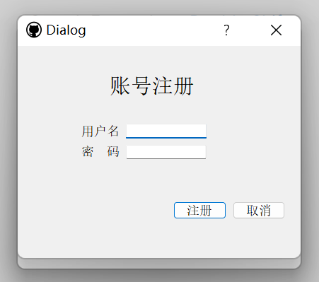
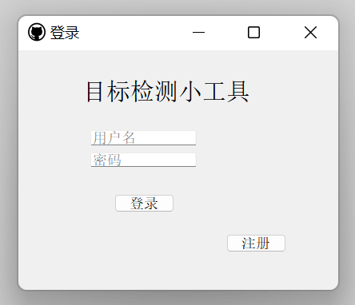
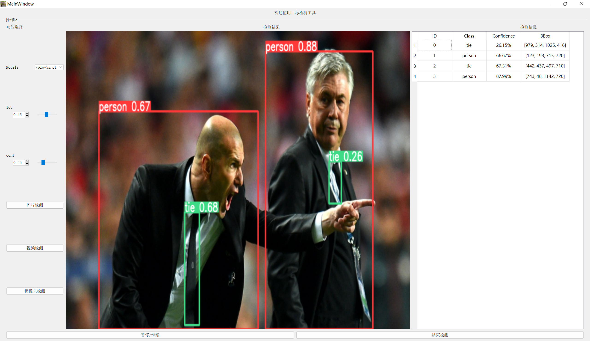
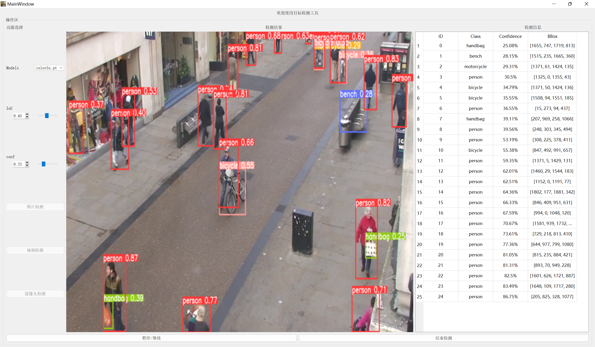
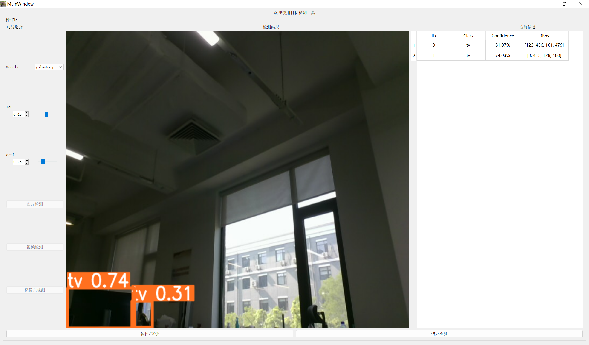

## **一、项目简介**
给yolov5-7.0版本加个gui界面，使用pyqt5，包含注册和登录界面，分别采用定时器QTimer和线程QThread显示视频帧，并实现简单的界面跳转，具体情况如下：

**特点：**
 1. UI界面与逻辑代码分离
 2. 支持自选定模型
 3. 同时输出检测结果与相应相关信息
 4. 支持图片，视频，摄像头检测
 5. 支持视频暂停与继续检测

**目的：**
 1. 熟悉QtDesign的使用
 2. 了解PyQt5基础控件与布局方法
 3. 了解界面跳转
 4. 了解信号与槽
 5. 熟悉视频在PyQt中的处理方法

**项目图片：**

登录界面

注册界面

图片检测

视频检测

摄像头检测

## **二、快速开始**
**环境与相关文件配置：**
 - 按照 ult-yolov5 中requirement的要求配置环境，自行安装PyQt5，注意都需要在一个evn环境中进行安装与配置
 - 下载或训练一个模型，将“.pt”文件放到weights文件夹 （权重文件可以自己选，程序默认打开weights文件夹，支持用yolov5-7.0版本训练的模型）
 - 新建output/img_output文件夹保存图片检测结果、新建output/video_output文件夹保存视频检测结果

**程序运行方式：**

 - 直接运行detect_logical.py，进入用定时器QTimer写的检测界面
 - 直接运行detect_logical_qthread.py，进入用线程QThread写的检测界面
 - 运行main_logical.py，先注册登录，再进入检测界面

## **三、 参考与致谢**
 - https://github.com/BonesCat/YoloV5_PyQt5  这位大神用的是yolov5-4.0版本，我用的yolov5-7.0版本自己训练的模型不适配，因此在此基础上做了一些修改和创新
 - https://xugaoxiang.com/category/programming-languages/python/pyqt5/  pyqt界面设计参考了这个大神的框架，定时器QTimer和线程QThread以及信号与槽讲的很好

## **四、 联系方式**
如需要完整项目，请联系

